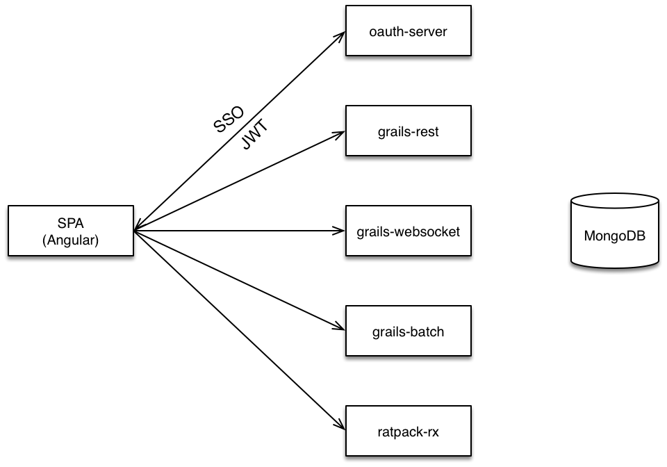

Grails - Angular - MongoDB polyglot (Work-In-Progress)

1. auth server  
2. rest resource
5. async resource
4. batch resource
5. angular SPA (UI)

Grails microservices security with OAuth / JWT demo

Client: SPA (Angular)

gradle auth-server:run
gradle auth-server:clean

gradle grails-rest:run
gradle grails-rest:clean
 

To start the MongoDB 
```bash
 mongod --config data/mongod.conf
```
     
curl -H "Accept: application/json" user:password@localhost:8080/oauth/token -d grant_type=client_credentials


[]

Ref: https://github.com/dsyer/spring-security-angular/tree/master/oauth2

